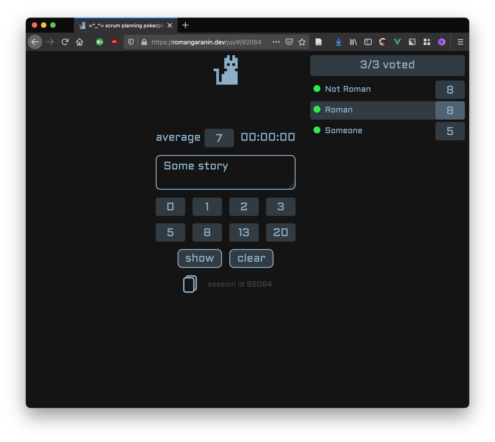

= planning-poker



This is simplistic scrum planning poker application.
It keeps all data in memory, and expire it after period of inactivity.

Currently, consists of `backend` part (golang) and `frontend` part (vuejs).

== build
=== backend
`go build ./cmd/web`

==== docker
`docker build -t planning-poker ./ && docker run --rm -p 10080:10080 --name planning-poker -t planning-poker`

=== frontend
```
yarn install
yarn run serve #run local dev build
yarn run build #production build
```
Local dev build will try to access backend on `http://127.0.0.1:10080/api`.

For production build don't forget to update `.env.production` file's variables `VUE_APP_BACKEND_URL` and `VUE_APP_BASE_URL`.

See also link:frontend/vuejs/README.md[frontend README]


== endpoints

[source]
----
POST localhost:10080/api/sessions
----

[source]
----
POST localhost:10080/api/sessions/SESSION_ID/join
Content-Type: application/json
{
    "name": "Roman"
}
----

[source]
----
GET localhost:10080/api/sessions/SESSION_ID/get/USER_ID
----

[source]
----
POST localhost:10080/api/sessions/SESSION_ID/vote
Content-Type: application/json
{
    "user_id": USER_ID,
    "vote": 42.42
}
----

[source]
----
POST localhost:10080/api/sessions/SESSION_ID/clear
----

[source]
----
POST localhost:10080/api/sessions/SESSION_ID/show
----
